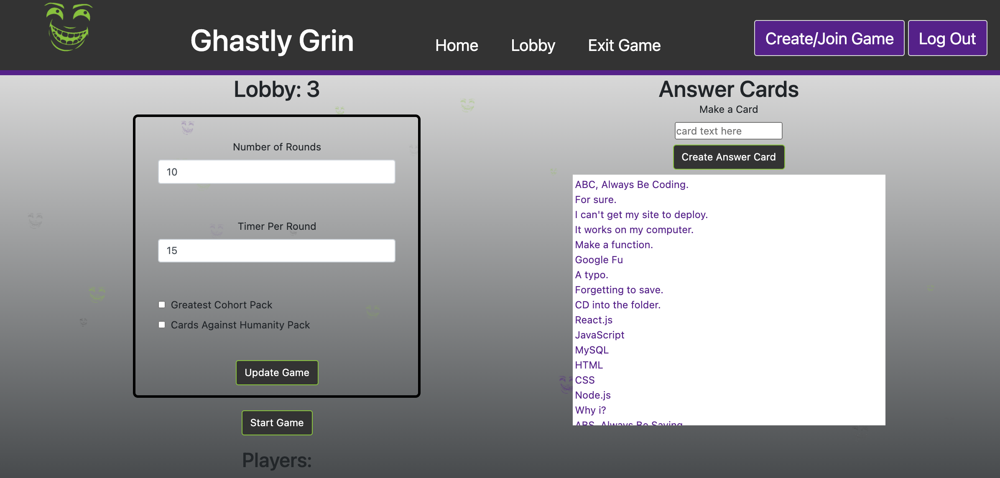
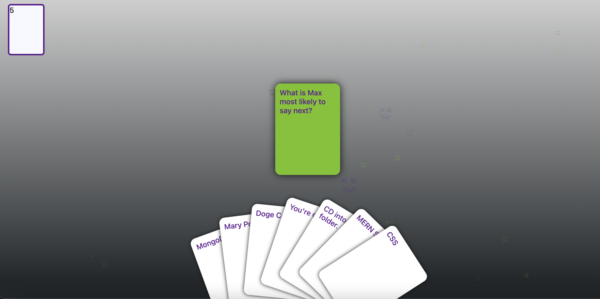

# Ghastly-Grin
A SERN stack application that lets the user create a user or login and then select from either a stack of cards called in from the Cards Against Humanity API or from the greatest cohort stack, with the host having the option of creating additional cards as well. 

## Table of Contents

* [MySQL](#MySQL)
* [Express](#Express)
* [React](#React)
* [Node](#Node)
* [Installation](#Installation)
* [Contributors](#Contributors)

## MySQL
MySQL was used as the database for this project, storing all of the user information as well as the games created, games played, rounds won and the data on the cards themselves. 

## Express
We used Express and sequeleize in the back end and then hosted the site on Heroku. The site can be seen below. 

Link to deployed application: [Deployed site](https://ghastlygrin.herokuapp.com/)

## React
React is used as the front-end framework to route and render the pages accordingly. 

## Node
Node.js was used as the back end language.   

Homepage with instructions on how to play the game

Signup/Login page

User can either create a new lobby or join an existing lobby to play with friends

Lobby page were the user has the option of either pulling in the Cards Against Humanity API, using the greatest cohort pack or creating their own cards for the game. The game owner also gets to determine the number of rounds and the time per round. 

A green card with the question is then given to all the players along with an assortment of random cards to select from. 

## Installation

There is no need to install anything, to use the app and play the game simply follow the link below. 

See deployed site here: [Deployed Site](https://ghastlygrin.herokuapp.com/)

To view our code see our GitHub below. 

See repository here: [GitHub Repo](https://github.com/JD-Jaramillo/Ghastly-Grin)

## Contributors
[Juan Jaramillo](https://github.com/JD-Jaramillo)

[Shawn Fox](https://github.com/SFoxGit)

[Eric Hurley](https://github.com/HurleySquared)

[Sommer Moya-Mendez ](https://github.com/smoyamendez)

[Milton ](https://github.com/basedmilz)